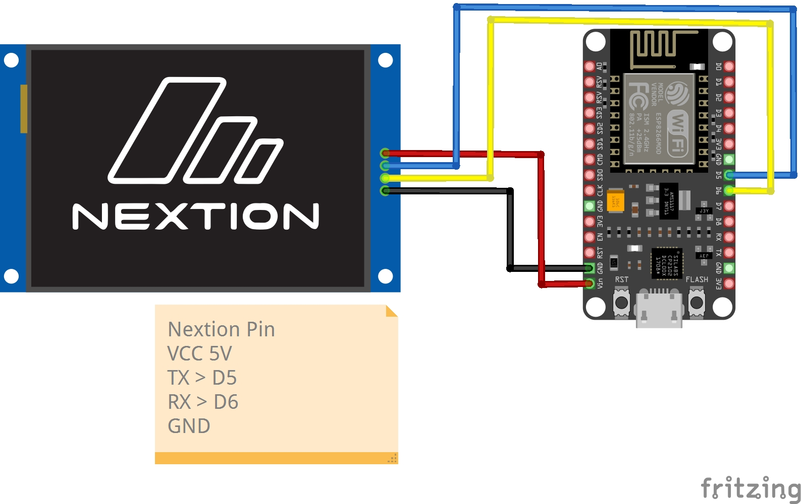

# WiFi Clock ESP8266

Project files and images for the Nextion display based WiFi clock using an ESP8266.

### Screenshot

If the image does not display on GitHub, ensure `WiFi_Clock_ESP8266.jpg` is committed to the repository at the project root alongside this README.

